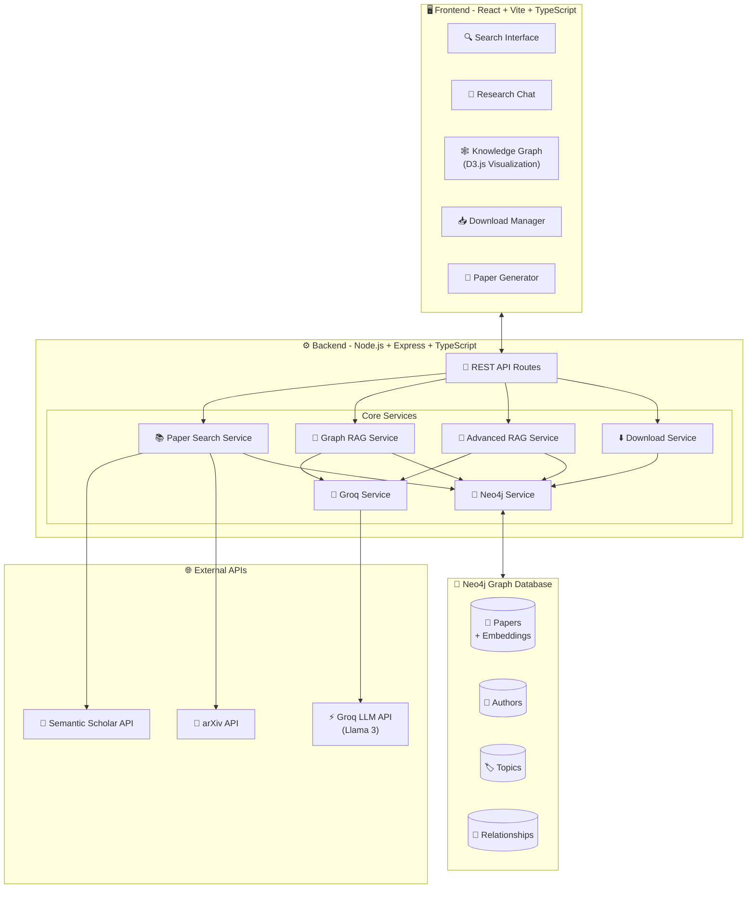
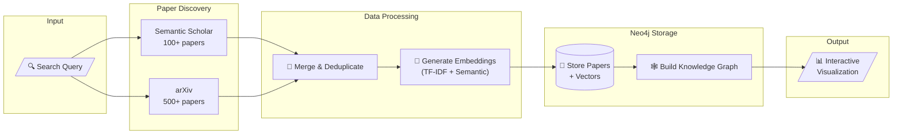
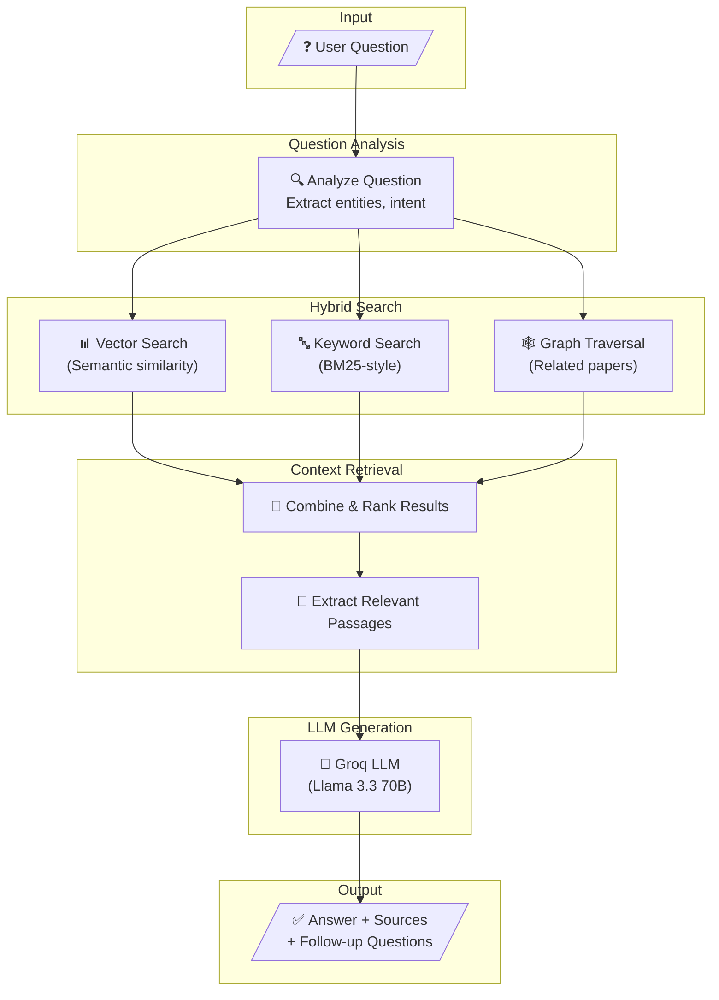
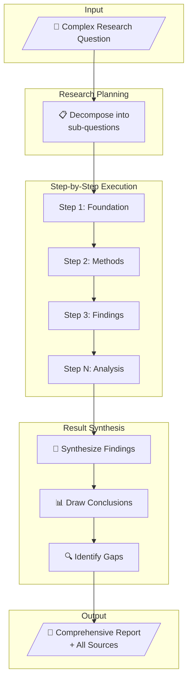
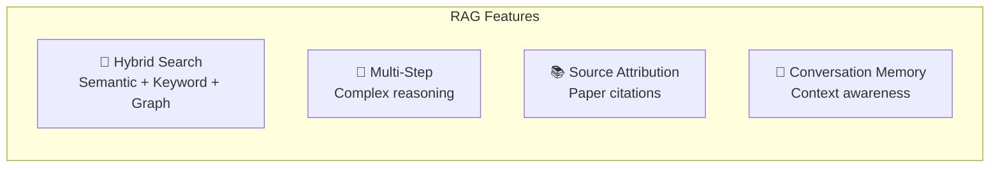
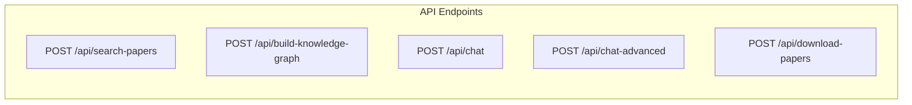

# 🧠 ResearchReasoner

**AI-Powered Research Discovery Platform**

An advanced research paper discovery and analysis tool that combines knowledge graph visualization, intelligent Q&A, and automated paper management using Neo4j and Large Language Models.


---

## ✨ Features

- 🔍 **Multi-Source Paper Discovery** - Search across Semantic Scholar & arXiv (100-700 papers)
- 🕸️ **Interactive Knowledge Graph** - Visualize research connections like Connected Papers
- 💬 **AI Research Assistant** - Chat with your papers using advanced RAG (Retrieval Augmented Generation)
- 🤖 **Multi-Step Reasoning** - Complex research investigations with step-by-step analysis
- 📄 **Automated PDF Downloads** - Bulk paper acquisition with local storage
- 📊 **Research Analytics** - Citation networks, author collaboration, trend analysis
- 🎓 **Auto-Generate Research Papers** - Create literature reviews from your database
- 💾 **Neo4j Graph Database** - Persistent storage with vector embeddings

---

## 🏗️ System Architecture



---

## 🔄 Data Flow Pipelines

### Paper Discovery Pipeline



### RAG (Retrieval Augmented Generation) Pipeline



### Multi-Step Research Investigation



---

## 🚀 Quick Start

### Prerequisites

- Node.js 18+
- Neo4j database (local or cloud)
- Groq API key (free at https://console.groq.com)

### Installation

```bash
# Clone the repository
git clone https://github.com/your-username/ResearchReasoner.git
cd ResearchReasoner

# Setup Backend
cd researchreasoner-backend
npm install
cp .env.example .env
# Edit .env with your Neo4j and Groq credentials
npm run dev

# Setup Frontend (in new terminal)
cd frontend
npm install
npm run dev
```

Visit http://localhost:5173 and start exploring research!

**📖 For detailed setup, see [QUICK_START.md](./QUICK_START.md)**

---

## 🌐 Deployment

Deploy to production in minutes:

**Quick Deploy:**
- Frontend: Vercel (Free tier)
- Backend: Railway ($5/mo)
- Database: Neo4j Aura (Free tier)

**📖 Full deployment guide: [DEPLOYMENT.md](./DEPLOYMENT.md)**

---

## 📁 Project Structure

```
ResearchReasoner/
├── 📂 frontend/                    # React frontend application
│   ├── src/
│   │   ├── components/            # UI components
│   │   │   ├── SearchInterface.tsx       # Paper search
│   │   │   ├── EnhancedResearchChat.tsx  # AI chat interface
│   │   │   ├── BulkDownloadManager.tsx   # PDF downloads
│   │   │   └── ResearchPaperGenerator.tsx # Auto paper gen
│   │   ├── pages/                 # Main pages
│   │   └── types/                 # TypeScript types
│   └── package.json
│
├── 📂 researchreasoner-backend/    # Node.js backend API
│   ├── src/
│   │   ├── routes/                # API route handlers
│   │   ├── services/              # Core business logic
│   │   │   ├── neo4jService.ts           # Database operations
│   │   │   ├── graphRagService.ts        # RAG pipeline
│   │   │   ├── AdvancedRAGService.ts     # Multi-step reasoning
│   │   │   ├── paperSearchService.ts     # Paper discovery
│   │   │   ├── paperDownloadService.ts   # PDF management
│   │   │   └── groqService.ts            # LLM integration
│   │   └── index.ts               # Express server entry
│   └── package.json
│
├── 📄 README.md                    # This file
├── 📄 QUICK_START.md              # Quick setup guide
├── 📄 DEPLOYMENT.md               # Production deployment
└── 📄 BACKEND_API_DOCUMENTATION.md # API reference
```

---

## 🎯 Usage Examples

### 1. Discover Research Papers

```typescript
// Search for papers on any topic
const results = await searchRealPapers("quantum computing");
// Returns: 100-700 papers with full metadata
```

### 2. Ask Research Questions

```typescript
// Simple mode - Quick answers
"What are the main approaches in machine learning?"

// Advanced mode - Deep analysis
"Compare transformer architectures in NLP"

// Investigation mode - Multi-step reasoning
"Investigate the evolution of deep learning from 2015 to 2024"
```

### 3. Visualize Knowledge Graphs

- Interactive force-directed graph
- Click nodes to view paper details
- Download PDFs with one click
- Explore citation networks

### 4. Generate Research Papers

```typescript
// Auto-generate literature reviews
"Generate a survey paper on neural networks"
"Create a technical report on quantum algorithms"
```

---

## 🔧 Configuration

### Backend Environment Variables

```bash
# Required
NEO4J_URI=bolt://localhost:7687
NEO4J_USERNAME=neo4j
NEO4J_PASSWORD=your_password
GROQ_API_KEY=gsk_your_key

# Optional
PORT=3002
NODE_ENV=development
MAX_PAPERS_PER_SEARCH=500
```

### Frontend Environment Variables

```bash
VITE_API_BASE_URL=http://localhost:3002/api
```

See `.env.example` files for complete configuration options.

---

## 📊 Key Features Explained

### Advanced RAG (Retrieval Augmented Generation)



- **Hybrid Search**: Combines semantic, keyword, and graph-based search
- **Multi-Step Reasoning**: Breaks complex questions into research steps
- **Source Attribution**: Every answer includes paper citations
- **Conversation Memory**: Maintains context across chat sessions

### Knowledge Graph

- **Citation Networks**: Map paper-to-paper references
- **Author Collaboration**: Identify research communities
- **Content Similarity**: Find related papers by topic
- **Temporal Analysis**: Track research evolution over time

### Paper Management

- **Automatic Downloads**: PDF acquisition from multiple sources
- **Local Storage**: Papers stored in Neo4j database
- **Full-Text Search**: Query within paper content
- **Batch Operations**: Download hundreds of papers at once

---

## 🧪 API Documentation

### Main Endpoints



| Endpoint | Method | Description |
|----------|--------|-------------|
| `/api/search-papers` | POST | Search for papers on a topic |
| `/api/build-knowledge-graph` | POST | Build and store knowledge graph |
| `/api/chat` | POST | Simple RAG Q&A |
| `/api/chat-advanced` | POST | Multi-step investigation |
| `/api/download-papers` | POST | Bulk PDF download |

**📖 Full API docs: [BACKEND_API_DOCUMENTATION.md](./BACKEND_API_DOCUMENTATION.md)**

---

## 🛠️ Tech Stack

| Layer | Technology |
|-------|------------|
| **Frontend** | React 18, TypeScript, Vite, TailwindCSS, shadcn/ui, D3.js |
| **Backend** | Node.js, Express, TypeScript |
| **Database** | Neo4j (Graph + Vector Search) |
| **LLM** | Groq (Llama 3.3 70B) |
| **APIs** | Semantic Scholar, arXiv |

---

## 🤝 Contributing

Contributions are welcome! Please:

1. Fork the repository
2. Create a feature branch (`git checkout -b feature/amazing-feature`)
3. Commit your changes (`git commit -m 'Add amazing feature'`)
4. Push to the branch (`git push origin feature/amazing-feature`)
5. Open a Pull Request

---

## 📝 License

This project is licensed under the MIT License - see the [LICENSE](LICENSE) file for details.

---

## 🙏 Acknowledgments

- Built for research enthusiasts and academics
- Powered by Neo4j, Groq, and amazing open-source tools
- Inspired by Connected Papers and research discovery tools

---

## 📞 Support

- 📖 **Documentation**: See [DEPLOYMENT.md](./DEPLOYMENT.md) and [QUICK_START.md](./QUICK_START.md)
- 🐛 **Issues**: Open an issue on GitHub
- 💬 **Discussions**: Use GitHub Discussions

---

**Made with ❤️ for the research community**
