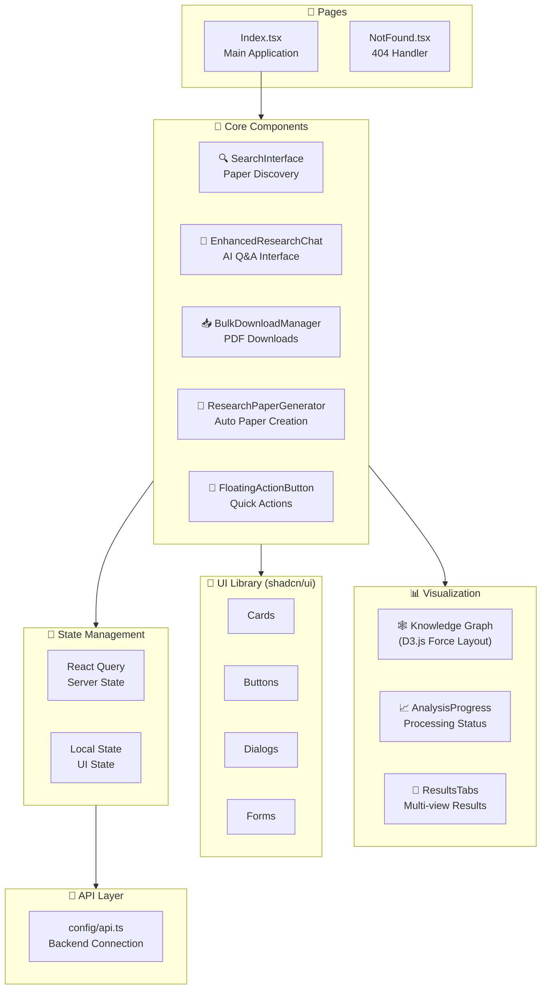
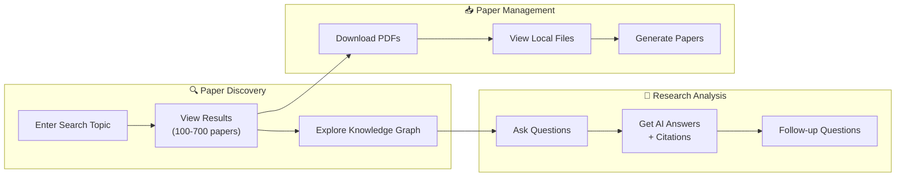
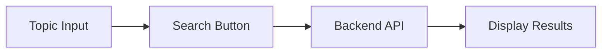
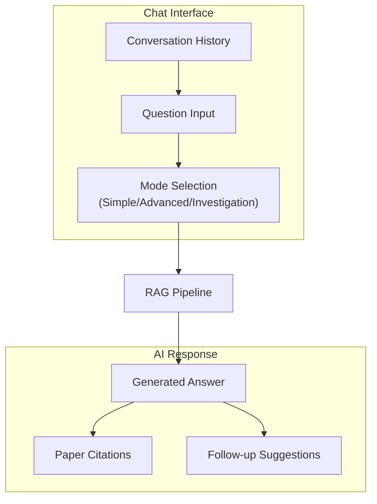
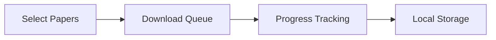

# 🖥️ ResearchReasoner Frontend

**React-based UI for AI-Powered Research Discovery**

The frontend application for ResearchReasoner - providing an intuitive interface for paper discovery, knowledge graph visualization, and AI-powered research assistance.


---

## 🏗️ Frontend Architecture



---

## 🔄 User Flow



---

## 📁 Directory Structure

```
frontend/
├── 📂 src/
│   ├── 📂 components/          # React components
│   │   ├── SearchInterface.tsx        # Search input & controls
│   │   ├── EnhancedResearchChat.tsx   # AI chat with RAG
│   │   ├── BulkDownloadManager.tsx    # PDF download UI
│   │   ├── ResearchPaperGenerator.tsx # Auto paper generation
│   │   ├── FloatingActionButton.tsx   # Quick action menu
│   │   ├── AnalysisProgress.tsx       # Progress indicators
│   │   ├── ResultsTabs.tsx            # Tabbed results view
│   │   ├── 📂 tabs/                   # Tab components
│   │   └── 📂 ui/                     # shadcn/ui components
│   │
│   ├── 📂 pages/               # Page components
│   │   ├── Index.tsx                  # Main application page
│   │   └── NotFound.tsx               # 404 error page
│   │
│   ├── 📂 config/              # Configuration
│   │   └── api.ts                     # API endpoint config
│   │
│   ├── 📂 hooks/               # Custom React hooks
│   ├── 📂 lib/                 # Utility functions
│   ├── 📂 types/               # TypeScript definitions
│   │
│   ├── App.tsx                 # Root component
│   ├── main.tsx               # Entry point
│   └── index.css              # Global styles
│
├── 📄 index.html              # HTML template
├── 📄 vite.config.ts          # Vite configuration
├── 📄 tailwind.config.ts      # TailwindCSS config
├── 📄 tsconfig.json           # TypeScript config
└── 📄 package.json            # Dependencies
```

---

## 🚀 Quick Start

### Prerequisites

- Node.js 18+
- npm or bun

### Installation

```bash
# Navigate to frontend directory
cd frontend

# Install dependencies
npm install

# Create environment file
cp .env.example .env
# Edit .env with your backend URL

# Start development server
npm run dev
```

Visit http://localhost:5173

### Environment Variables

```bash
# Backend API URL
VITE_API_BASE_URL=http://localhost:3002/api
```

---

## 🧩 Key Components

### SearchInterface

**Purpose**: Paper discovery and search controls



**Features**:
- Topic-based search input
- Search mode selection
- Result count display

---

### EnhancedResearchChat

**Purpose**: AI-powered Q&A with your research papers



**Features**:
- Multiple chat modes (Simple, Advanced, Investigation)
- Source attribution with paper links
- Conversation memory
- Follow-up question suggestions

---

### BulkDownloadManager

**Purpose**: Batch PDF download and management



**Features**:
- Bulk paper selection
- Progress tracking
- File size display
- Download history

---

### ResearchPaperGenerator

**Purpose**: Automatically generate research papers from your database

**Features**:
- Literature review generation
- Topic synthesis
- Citation management
- Export options

---

## 🎨 UI Components (shadcn/ui)

The frontend uses [shadcn/ui](https://ui.shadcn.com/) for consistent, accessible components:

| Component | Usage |
|-----------|-------|
| `Card` | Paper cards, result displays |
| `Button` | Actions, navigation |
| `Dialog` | Modals, confirmations |
| `Tabs` | Result view switching |
| `Input` | Search, chat input |
| `Progress` | Download progress |
| `Badge` | Status indicators |

---

## 🛠️ Development

### Available Scripts

```bash
# Development server
npm run dev

# Production build
npm run build

# Preview production build
npm run preview

# Lint code
npm run lint

# Type check
npx tsc --noEmit
```

### Code Style

- **TypeScript**: Strict mode enabled
- **ESLint**: Configured with React rules
- **Prettier**: Code formatting (optional)

---

## 🔗 API Integration

The frontend communicates with the backend through RESTful APIs:

```typescript
// config/api.ts
const API_BASE = import.meta.env.VITE_API_BASE_URL;

// Example API calls
fetch(`${API_BASE}/search-papers`, { method: 'POST', body: JSON.stringify({ query }) })
fetch(`${API_BASE}/chat`, { method: 'POST', body: JSON.stringify({ question, mode }) })
fetch(`${API_BASE}/download-papers`, { method: 'POST', body: JSON.stringify({ papers }) })
```

---

## 📦 Dependencies

### Core

| Package | Purpose |
|---------|---------|
| `react` | UI framework |
| `react-dom` | DOM rendering |
| `vite` | Build tool |
| `typescript` | Type safety |

### Styling

| Package | Purpose |
|---------|---------|
| `tailwindcss` | Utility CSS |
| `@radix-ui/*` | Headless UI primitives |
| `class-variance-authority` | Component variants |
| `lucide-react` | Icons |

### Visualization

| Package | Purpose |
|---------|---------|
| `d3` | Knowledge graph rendering |
| `recharts` | Charts and analytics |

---

## 🤝 Contributing

1. Follow the existing component patterns
2. Use TypeScript for all new code
3. Add proper types for props and state
4. Test components in development before PR

---

**Part of [ResearchReasoner](../README.md) - AI-Powered Research Discovery Platform**
