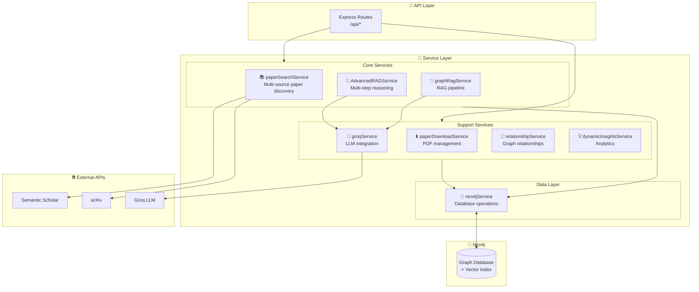
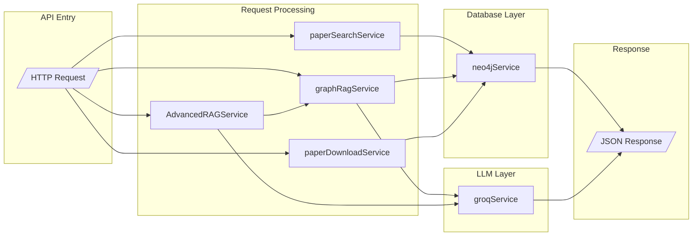
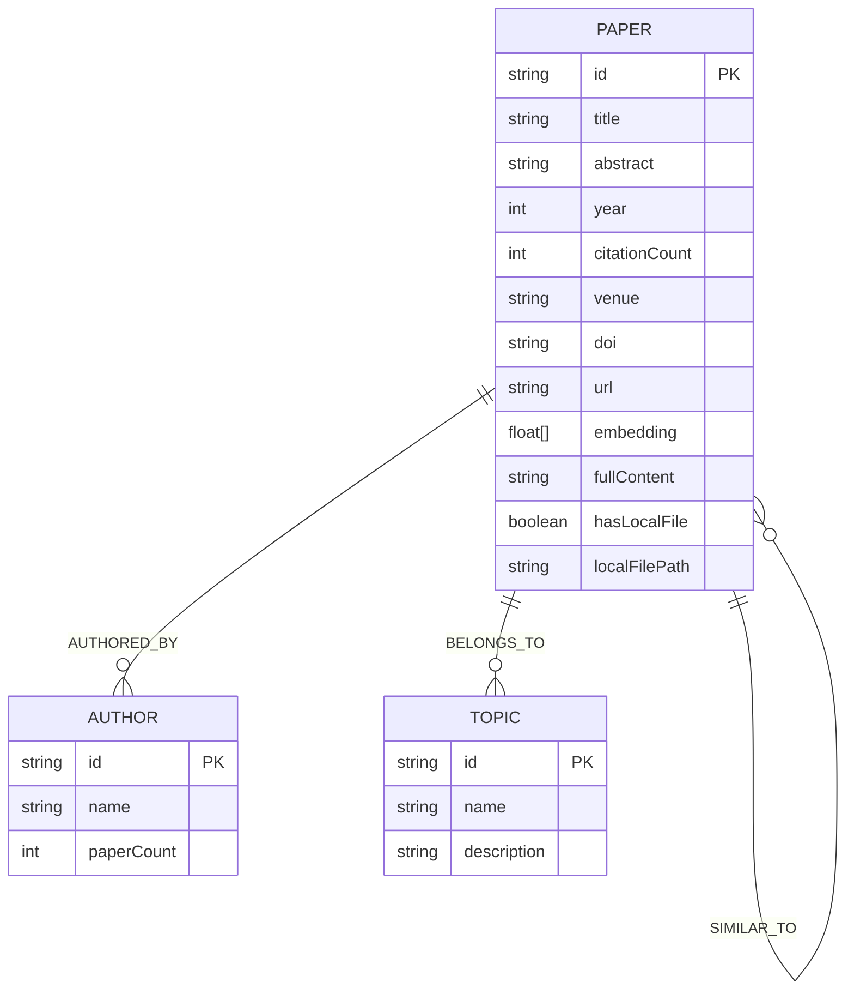
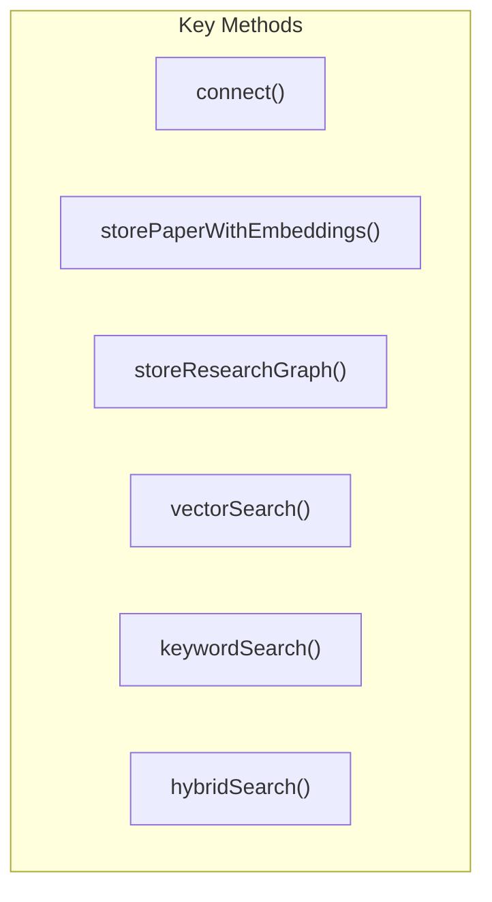
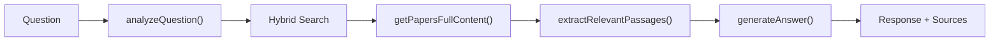
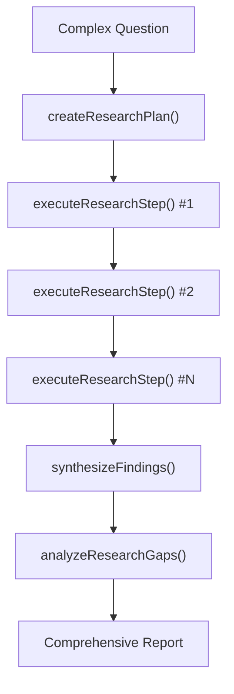
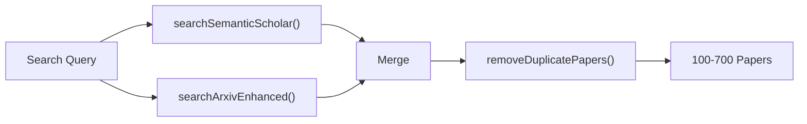
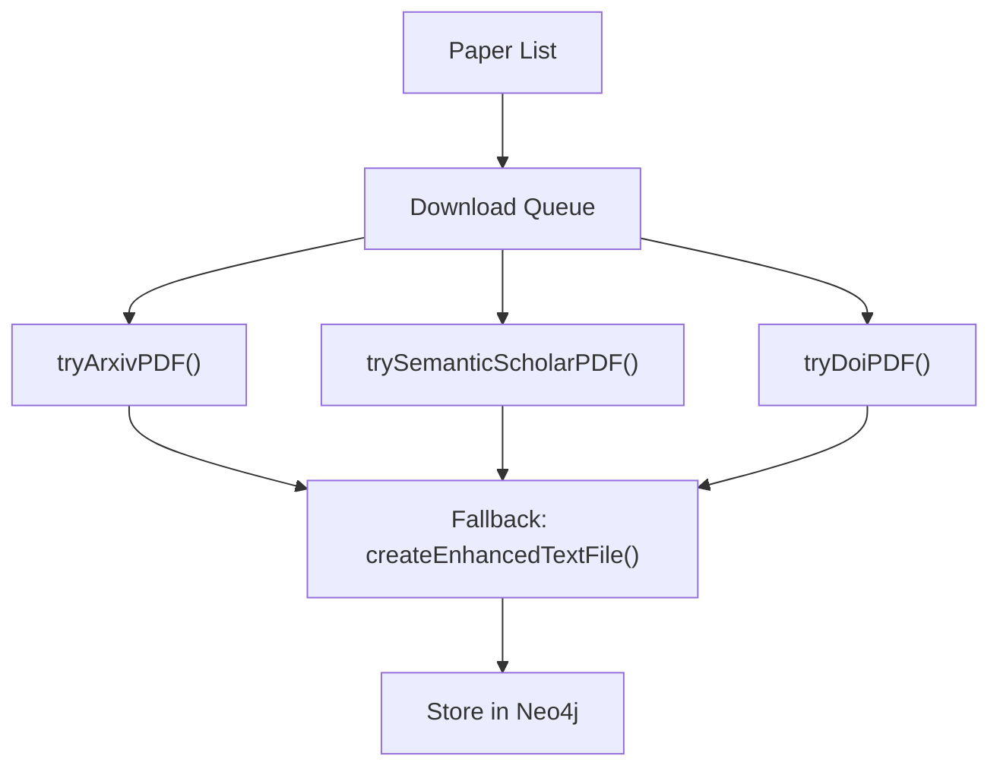

# ⚙️ ResearchReasoner Backend

**Node.js API for AI-Powered Research Discovery**

The backend server for ResearchReasoner - providing RESTful APIs for paper discovery, knowledge graph management, and AI-powered research assistance using Graph RAG.


---

## 🏗️ Backend Architecture



---

## 🔄 Service Interactions



---

## 💾 Neo4j Database Schema



### Graph Relationships

| Relationship | From | To | Properties |
|-------------|------|-----|------------|
| `AUTHORED_BY` | Paper | Author | position, affiliation |
| `BELONGS_TO` | Paper | Topic | confidence |
| `CITES` | Paper | Paper | - |
| `SIMILAR_TO` | Paper | Paper | similarity_score |

---

## 📁 Directory Structure

```
researchreasoner-backend/
├── 📂 src/
│   ├── 📄 index.ts                    # Express server entry point
│   │
│   ├── 📂 routes/                     # API route handlers
│   │   └── api.ts                     # All API endpoints
│   │
│   ├── 📂 services/                   # Business logic
│   │   ├── neo4jService.ts            # Database operations (59KB)
│   │   ├── graphRagService.ts         # RAG pipeline (16KB)
│   │   ├── AdvancedRAGService.ts      # Multi-step reasoning (24KB)
│   │   ├── paperSearchService.ts      # Paper discovery (19KB)
│   │   ├── paperDownloadService.ts    # PDF management (27KB)
│   │   ├── groqService.ts             # LLM integration (4KB)
│   │   ├── relationshipService.ts     # Graph relationships (13KB)
│   │   └── dynamicInsightsService.ts  # Analytics (2KB)
│   │
│   └── 📂 types/                      # TypeScript definitions
│       └── index.ts                   # Shared types
│
├── 📂 downloads/                      # Downloaded PDFs storage
├── 📄 Dockerfile                      # Docker image
├── 📄 package.json                    # Dependencies
├── 📄 tsconfig.json                   # TypeScript config
└── 📄 .env                            # Environment variables
```

---

## 🚀 Quick Start

### Prerequisites

- Node.js 18+
- Neo4j database (local or Neo4j Aura)
- Groq API key

### Installation

```bash
# Navigate to backend directory
cd researchreasoner-backend

# Install dependencies
npm install

# Create environment file
cp .env.example .env
# Edit .env with your credentials

# Start development server
npm run dev
```

Server runs at http://localhost:3002

### Environment Variables

```bash
# Required
NEO4J_URI=bolt://localhost:7687
NEO4J_USERNAME=neo4j
NEO4J_PASSWORD=your_password
GROQ_API_KEY=gsk_your_api_key

# Optional
PORT=3002
NODE_ENV=development
```

---

## 📚 Service Documentation

### neo4jService

The core database service handling all Neo4j operations.



**Key Features**:
- Connection management with auto-reconnect
- Vector embedding generation (TF-IDF + semantic)
- Hybrid search (vector + keyword + graph)
- Paper storage with full content

---

### graphRagService

Implements the RAG (Retrieval Augmented Generation) pipeline.



**Key Features**:
- Question analysis and intent detection
- Multi-source context retrieval
- LLM-powered answer generation
- Source attribution

---

### AdvancedRAGService

Extends GraphRAGService with multi-step reasoning capabilities.



**Key Features**:
- Question decomposition into sub-questions
- Step-by-step research execution
- Cross-step synthesis
- Gap and limitation analysis

---

### paperSearchService

Multi-source paper discovery service.



**Key Features**:
- Semantic Scholar API integration
- arXiv API integration
- Duplicate detection
- Fallback paper generation

---

### paperDownloadService

PDF download and storage management.



**Key Features**:
- Multi-source PDF download
- Concurrent download management
- Fallback text file creation
- Database storage integration

---

### groqService

LLM integration using Groq API.

**Features**:
- Groq API wrapper
- Response streaming support
- Error handling and retries
- Token management

---

## 🔌 API Endpoints

### Paper Discovery

| Endpoint | Method | Description |
|----------|--------|-------------|
| `/api/search-papers` | POST | Search for papers |
| `/api/build-knowledge-graph` | POST | Build and store graph |
| `/api/get-graph` | GET | Retrieve stored graph |

### AI Chat

| Endpoint | Method | Description |
|----------|--------|-------------|
| `/api/chat` | POST | Simple RAG Q&A |
| `/api/chat-advanced` | POST | Multi-step investigation |

### Paper Management

| Endpoint | Method | Description |
|----------|--------|-------------|
| `/api/download-papers` | POST | Bulk PDF download |
| `/api/download-stats` | GET | Download statistics |

### Analytics

| Endpoint | Method | Description |
|----------|--------|-------------|
| `/api/research-trends` | POST | Temporal analysis |
| `/api/compare-methodologies` | POST | Methodology comparison |

---

## 🐳 Docker Deployment

### Build Image

```bash
docker build -t researchreasoner-backend .
```

### Run Container

```bash
docker run -p 3002:3002 \
  -e NEO4J_URI=bolt://host.docker.internal:7687 \
  -e NEO4J_USERNAME=neo4j \
  -e NEO4J_PASSWORD=password \
  -e GROQ_API_KEY=gsk_xxx \
  researchreasoner-backend
```

See [DOCKER_DEPLOYMENT.md](./DOCKER_DEPLOYMENT.md) for detailed instructions.

---

## 🛠️ Development

### Available Scripts

```bash
# Development with hot reload
npm run dev

# Production build
npm run build

# Start production server
npm start

# Type check
npx tsc --noEmit
```

### Adding New Services

1. Create service file in `src/services/`
2. Export singleton instance
3. Import in routes as needed
4. Add types to `src/types/`

---

## 📦 Dependencies

| Package | Purpose |
|---------|---------|
| `express` | Web framework |
| `neo4j-driver` | Neo4j database driver |
| `axios` | HTTP client for APIs |
| `typescript` | Type safety |
| `ts-node-dev` | Development server |

---

**Part of [ResearchReasoner](../README.md) - AI-Powered Research Discovery Platform**
